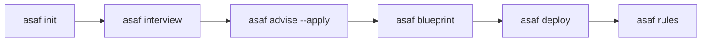

# AI Software Architect Framework (ASAF) 🤖📐

**ASAF** es un estándar y framework independiente del modelo de IA que ayuda a diseñar, crear, mantener y evolucionar proyectos de software mediante arquitectos virtuales, gobernanza de código estática y un motor de contexto inteligente basado en Grafos Semánticos. 

Su propósito principal es guiar a desarrolladores e Inteligencias Artificiales en la toma de decisiones arquitectónicas y la automatización de la infraestructura, minimizando el consumo de tokens mediante slicing sintáctico y previniendo la degradación del código mediante auditorías automatizadas.

> [!IMPORTANT]
> **Estado del Proyecto:** `Alfa Cerrada / Developer Preview`. 
> El analizador AST semántico y el linter de gobernanza están optimizados para el ecosistema **TypeScript y JavaScript** en esta iteración.

---

## 🎯 Objetivos y Características Core

* **Reducción de Tokens mediante Slicing de AST:** ASAF analiza el código fuente con el compilador oficial de TypeScript, extrae las firmas estructurales de clases, métodos e inyecciones de dependencias, y remueve el cuerpo de las funciones para inyectar un contexto ultraligero a la IA.
* **Architecture Governance (Linter de Capas):** Valida de forma estática que las dependencias de importación cumplan estrictamente con las capas de *Clean Architecture* o *DDD* (ej. previniendo que el Dominio dependa de casos de uso o infraestructura).
* **Decisiones Enlazadas (Enriched ADRs):** Genera propuestas arquitectónicas que incluyen no solo pros/contras, sino análisis de impacto en la base de código, matriz de riesgos y un plan de evolución técnica a largo plazo.
* **Puente de Agentes Universal (IDE Rules):** Auto-genera directivas de contexto (`.cursorrules`, `.clinerules`) que le enseñan a cualquier IA cómo interactuar con el proyecto y respetar las decisiones aprobadas.
* **Deployment Desacoplado:** Genera de forma automatizada contenedores Docker, plantillas de infraestructura como código (Terraform) y pipelines de CI/CD (GitHub Actions) que auditan la arquitectura en cada Pull Request.

---

## 📂 Estructura del Proyecto

```
ASAF/
├── advisor/         # Motor de recomendaciones enriquecidas (ADRs, riesgos, evolución).
├── agents/          # Pool de agentes de IA especializados con checklists (BA, Arch, Dev, QA, Security, DevOps).
├── blueprints/      # Plantillas de arquitectura de referencia (ej. NestJS Clean Architecture).
├── cli/             # Interfaz de línea de comandos (CLI) principal de ASAF.
├── context/         # Motor de slicing sintáctico y vinculación de ADRs en prompts.
├── core/            # Núcleo de gobernanza, linter de capas y sistema de plugins.
├── discovery/       # Analizador AST nativo (TypeScript compiler), grafos semánticos y de conocimiento.
├── docs/            # Documentación y especificación de exposición (MCP, REST, SDKs).
└── generators/      # Generadores de infraestructura (Docker, Terraform, CI/CD).
```

---

## 💻 Comandos del CLI

### 1. `asaf init`
Inicializa la configuración de ASAF en el repositorio actual creando el archivo `asaf.json`.
```bash
npx asaf init
```

### 2. `asaf analyze`
Analiza el repositorio utilizando el compilador sintáctico de TypeScript, mapeando las clases, inyecciones de dependencias y commits de Git. Genera:
* `asaf-graph.json` (Grafo físico)
* `asaf-semantic-graph.json` (Grafo relacional de clases)
* `asaf-knowledge-graph.json` (Memoria del proyecto)
```bash
npx asaf analyze
```

### 3. `asaf check`
Audita el cumplimiento de las capas arquitectónicas (linter de gobernanza). Si detecta violaciones (ej. el Dominio importando infraestructura), imprime los errores y sale con código `exit 1` (ideal para pipelines de CI/CD).
```bash
npx asaf check
```

### 4. `asaf context`
Muestra el impacto de los cambios de Git.
* Usa el flag `--prompt` para exportar un prompt en Markdown listo para copiar/pegar en tu IA, conteniendo las decisiones de arquitectura (ADRs) a respetar y el código fuente con slicing estructural.
```bash
npx asaf context --prompt
```

### 5. `asaf rules`
Genera directivas y reglas automatizadas para que tu asistente de IA (Cursor o Cline) siga los lineamientos de ASAF.
```bash
npx asaf rules --type all
```

### 6. `asaf advise`
Genera recomendaciones de arquitectura basadas en las variables de negocio de la entrevista y el stack real detectado en el código.
* Usa el flag `--apply` para registrar estas recomendaciones como ADRs oficiales en Markdown con matriz de riesgos e impacto.
```bash
npx asaf advise --apply
```

### 7. `asaf deploy`
Genera de forma desacoplada la infraestructura Terraform (AWS/Azure), contenedores Docker y workflows de CI/CD para automatizar las validaciones de ASAF.
```bash
npx asaf deploy --cloud aws
```

---

## 📖 Guía de Uso Avanzado: ¿Cómo usar ASAF en el día a día?

A continuación se detallan las guías de uso para los dos escenarios principales del ciclo de vida del software:

### Scenario A: Refactorizar y sanear un proyecto existente (ej. tu Backend)

Si tienes un proyecto con deuda técnica o violaciones de Clean Architecture, puedes delegarle la tarea de solución completa a tu IDE de IA (como **Cursor Agent** o la extensión **Cline** / **Roo Code** en modo autónomo).

1. Abre el chat de tu agente de IA y escribe el siguiente prompt exacto:
   > *"Por favor, lee las directivas de ASAF que están en el archivo de reglas de este repositorio. Ejecuta `npx asaf analyze` para mapear el Grafo Semántico y luego ejecuta `npx asaf check` para auditar el cumplimiento arquitectónico. 
   > 
   > Refactoriza de forma iterativa todos los archivos que reporten violaciones aplicando el patrón de Inversión de Dependencias (creando interfaces/puertos en la capa de aplicación/dominio) hasta que el comando `npx asaf check` pase completamente limpio con éxito."*

2. El agente de IA tomará control de la terminal, ejecutará el linter de ASAF y refactorizará el código de forma iterativa y autónoma hasta solucionar todas las inconsistencias estructurales.

---

### Scenario B: Iniciar un proyecto nuevo desde cero

Cuando comiences un desarrollo de software nuevo y quieras asegurar su robustez, mantenibilidad y escalabilidad desde el primer día:



1. **Crear e Inicializar:**
   ```bash
   mkdir mi-nuevo-proyecto
   cd mi-nuevo-proyecto
   npx asaf init
   ```
2. **Definir Requerimientos (Entrevista):**
   Responde las preguntas de negocio (presupuesto, nube, volumen de peticiones) en la consola:
   ```bash
   npx asaf interview
   ```
3. **Sentar las Bases Técnicas (ADRs):**
   Genera y aprueba el índice de decisiones técnicas oficiales del proyecto:
   ```bash
   npx asaf advise --apply
   ```
4. **Instanciar la Estructura de Código:**
   Crea la estructura limpia del proyecto de producción (ej: NestJS Clean Architecture):
   ```bash
   npx asaf blueprint -n nestjs-clean-architecture -o ./
   ```
5. **Generar Despliegue y Reglas de IA:**
   Genera los archivos Terraform, Docker, Pipelines de CI/CD y las reglas para Cursor/Cline:
   ```bash
   npx asaf deploy --cloud aws
   npx asaf rules
   ```
   *A partir de este instante, cualquier IA que programes sabrá exactamente dónde y cómo colocar la lógica sin que tengas que guiarla en tus prompts cotidianos.*

---

## 💡 Recomendaciones y Buenas Prácticas de Uso

* **No edites manualmente los archivos `asaf*.json`:** Estos archivos son generados dinámicamente por el compilador sintáctico de TypeScript y el constructor del Knowledge Graph. Cualquier edición manual se perderá al volver a ejecutar `npx asaf analyze`.
* **Secuencia de Auditoría:** Recuerda siempre correr `npx asaf analyze` antes de ejecutar `npx asaf check` o `npx asaf context`. El linter y el motor de contexto necesitan los grafos actualizados para calcular las dependencias de forma exacta.
* **Integración con Git Hooks (Pre-Commit):** Es altamente recomendable configurar un pre-commit hook (por ejemplo, con `husky`) para correr `npx asaf check` localmente. Esto evitará que subas código con violaciones arquitectónicas al repositorio.
* **Integración en CI/CD:** El comando `asaf check` retorna un código de salida `exit 1` cuando encuentra violaciones. Utiliza este comportamiento en tu pipeline de CI/CD para bloquear los pull requests de forma automatizada cuando la arquitectura se vea degradada.

---

## 📄 Licencia

Este proyecto está bajo la Licencia **MIT**.
